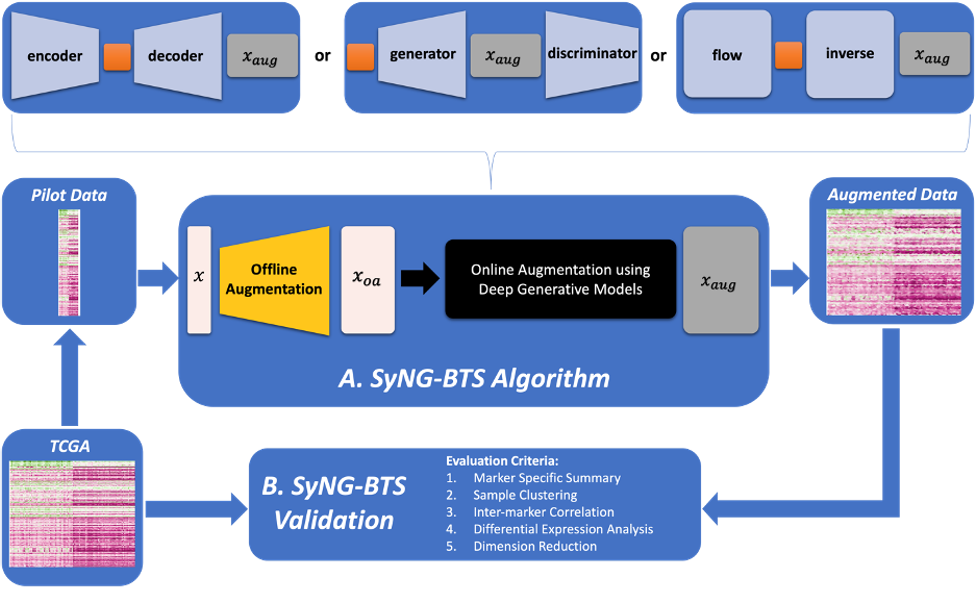
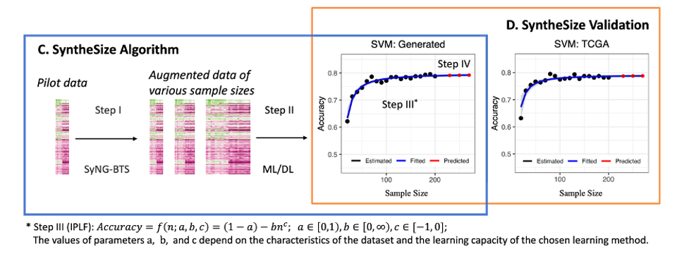

# SyntheSize-paper-supplementary-materials

This repository stores the data, results, and R scripts to generate these reuslts and figures for the corresponding paper *Optimizing Sample Size for Statistical Learning in Bulk Transcriptome Sequencing: A Learning Curve Approach*.

The method involves two algorithms: SyNG-BTS for augmenting sample sizes using deep generative models and SyntheSize for determing the optimal sample size.

SyNG-BTS is a data augmentation tool synthesizing transcriptomics data with realistic distributions without relying on a predefined formula. Three deep generative models are considered, incluing Variational Auto Encoder (VAE), Generative Adversarial Network (GAN), and flow-based generative model. Those models will be trained on a pilot dataset and then utilized to generate data for any desired number of samples. The workflow of SyNG-BTS is depicted in the following figure:

  

Original code for SyNG-BTS can be referred to [SyNG-BTS](https://github.com/LXQin/SyNG-BTS). 

SyntheSize is a supervised learning framework designed for determining the optimal sample size by utilizing synthesized data across various sample sizes. This framework employs the inverse power law function (IPLF) to accurately fit augmented data corresponding to different sample sizes and their respective prediction accuracies. SyntheSize also illustrates the generated results through heatmap and UMAP(Uniform Manifold Approximation and Projection).

The workflow of SyntheSize is depicted in the following figure:

  

Original code for SyntheSize can be referred to [SyntheSize](https://github.com/LXQin/SyntheSize). 

## Installation

This repository is *not a package* for SyntheSize. 
It stores the R scripts and data to generate the results and figures in the paper.

## Dependencies

To run the R code, you need to install the following packages:

    ggplot2 3.4.3
    tidyverse 2.0.0 
    DANA 1.1.1
    cowplot 1.1.1 
    ggpubr 0.6.0
    ggsci 3.0.0
    reshape2 1.4.4
    glmnet 4.1-7
    e1071 1.7-13 
    caret 6.0-94
    randomForest 4.7-1.1
    xgboost 1.7.6.1
    ROCR 1.0-11
    class 7.3-22
    
Please make sure to install all dependencies prior to running the code. 
The code presented here was implemented and tested in R version 4.1.1.

## Usage

1. Download this repository.
2. Set your R working directory to the root directory of the project.
3. Run or knit any of the following R markdowns
    - `DataOrganization.Rmd` to download TCGA data using TCGAbiolinks package, process the downloaded data into formatted counts and save them as .csv file.
    -  [SyNG-BTS](https://github.com/LXQin/SyNG-BTS) pacakge to generate new samples using deep generative models.
    - `Evaluation.Rmd` to evaluate the samples generated using pilot data.
    - `Visualization.R` to generate all the figures in the paper, including visualizing the generated samples by UMAP and heatmap and plotting the curve of prediction accuracies.
    - `CaseStudy.Rmd` to train the classfiers and fit a learning curve for BRCA and RNABRCA data sets.
    

